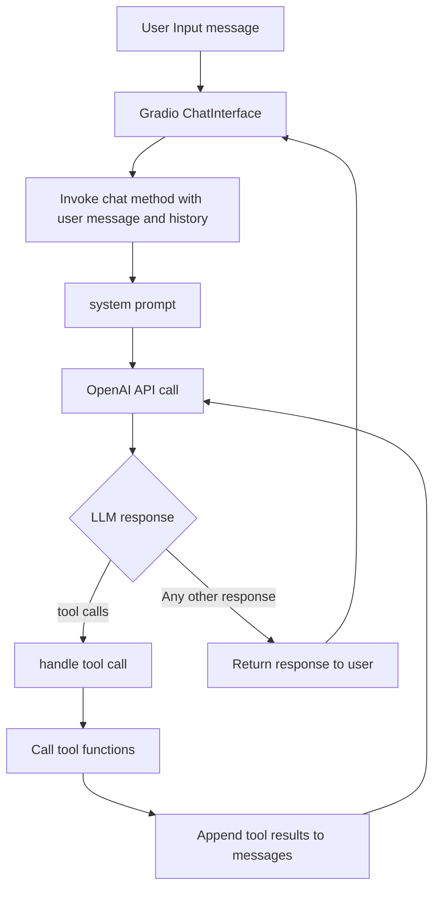

# Resume Agent: OpenAI LLM Chat App

This project is a conversational agent for Poornima Tom, powered by OpenAI LLM and Gradio. It loads profile and summary data, manages chat interactions, and handles tool calls for user engagement.

## Features
- Chat with Poornima Tom about her career, background, and experience
- Uses OpenAI LLM for intelligent responses
- Records user interest and unanswered questions via Pushover
- Loads profile from PDF and summary from text file
- Gradio web interface for easy interaction

## Class Diagram


## Setup Instructions

1. **Clone the repository:**
   ```sh
   git clone https://github.com/your-username/resume-agent.git
   cd resume-agent
   ```

2. **Create and activate a virtual environment:**
   ```sh
   python3 -m venv .venv
   source .venv/bin/activate
   ```

3. **Install dependencies:**
   ```sh
   pip install -r requirements.txt
   ```
   If `requirements.txt` is missing, install manually:
   ```sh
   pip install openai gradio pypdf requests python-dotenv
   ```

4. **Add your environment variables:**
   Create a `.env` file in the project root with:
   ```
   OPENAI_API_KEY=your-openai-api-key
   PUSHOVER_TOKEN=your-pushover-token
   PUSHOVER_USER=your-pushover-user
   ```

5. **Add profile and summary files:**
   - Place your LinkedIn PDF at `me/linkedin.pdf`
   - Place your summary text at `me/summary.txt`

## Running the App

Start the Gradio web interface:
```sh
python app.py
```

This will launch a local Gradio server and print a link in the terminal. Open the link in your browser to chat with the agent.

## Deployment
- You can deploy this app on platforms like Hugging Face Spaces, Heroku, or any cloud VM that supports Python and Gradio.
- Make sure to include all required files and environment variables.

## Security Notes
- **Never hardcode your API keys or secrets in the code.**
- Use the `.env` file for sensitive information.

## Troubleshooting
- If you see errors about missing files, check that `me/linkedin.pdf` and `me/summary.txt` exist.
- If you see API errors, verify your keys in `.env`.
- For dependency issues, ensure your virtual environment is activated and all packages are installed.

## Pushover Integration

This app uses Pushover to send notifications when users express interest or ask questions that cannot be answered. You will need a Pushover account and API credentials to enable this feature.

For more information and support, visit the official Pushover support page:
https://support.pushover.net/i7-what-is-pushover-and-how-do-i-use-it

